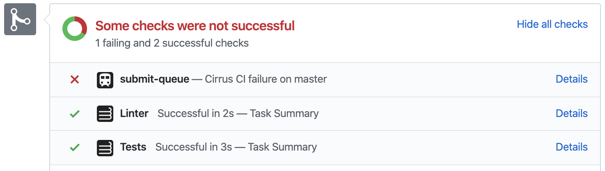

# GitHub App to Introduce Submit Queue 🚂

Blocks PR merges when check suites of the latest commit on a target branch are failing:

**Note:** initially [it was a GitHub Action](https://github.com/cirrus-actions/branch-guard) but unfortunetly Actions have permission issues when executed for PRs from forks.

# Installation Instructions

Install the app [here](https://github.com/apps/submit-queue).

## GitHub Enterprise

You can run the App on it's own. The setup is pretty straightforward. 

Use `docker.pkg.github.com/cirruslabs/gh-submit-queue/app:latest` Docker image with the 
following environment variables:

| Environment Variable Name | Value |  
|---|---|
| GITHUB_APP_ID | Id of a freshly registered [GitHub App](https://developer.github.com/apps/building-github-apps/creating-a-github-app/) ID |
| GITHUB_APP_CLIENT_ID | App client id from the settings page for [authentication](https://developer.github.com/v3/guides/basics-of-authentication/#registering-your-app) purposes |
| GITHUB_APP_CLIENT_SECRET | App client id from the settings page for authentication purposes |
| GITHUB_APP_PRIVATE_KEY_BASE64 | Base 64 encoded [private key of the App](https://developer.github.com/apps/building-github-apps/authenticating-with-github-apps/#generating-a-private-key) |
| GITHUB_APP_WEBHOOK_SECRET | **Optional** [secret to verify authenticity of webhook deliveries](https://developer.github.com/webhooks/securing/) |
